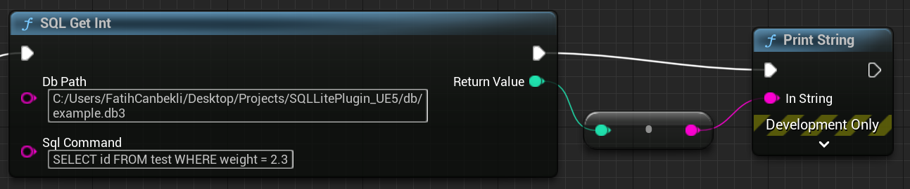
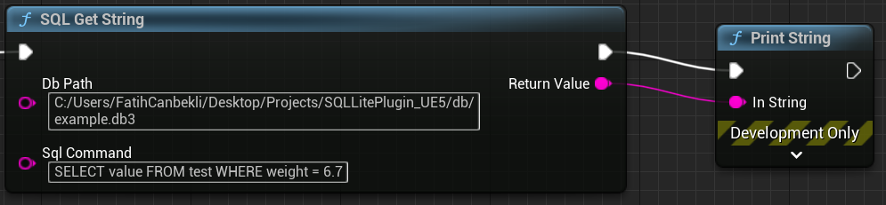

# SQLite Plugin for Unreal Engine 5

Databases are an efficient way to store data in many fields, including game development. This project aims to efficiently use a file database SQLite with Unreal Engine 5. It is still in the early stages of development, but when completed it aims for a full-fledged and intuitive user experience. I would be very happy if you try it and give feedback. You can find the plugin in the plugins folder.

## How to Use

The plugin acts as a blueprint library for now. To use it, first activate the plugin. Then when you right click on the graph, you will see a tab named SQLite. You can pull data from database using these methods.

Get integer value from DB

Get string value from DB

